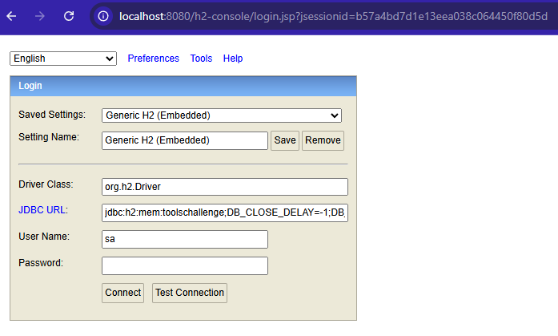

# API de Pagamentos – Tools Java Challenge [C]

Este projeto é uma implementação do desafio **Tools Java Challenge [C]**, simulando
uma API de pagamentos com autorização de transações e estorno.

A aplicação foi desenvolvida com:

- Java 17
- Spring Boot 3
- Spring Web
- Spring Data JPA
- H2 Database (em memória)
- Bean Validation

---

Obs: Na aplicação foram criados e utilizados outros JSONs com base no documento de base para o projeto.

## Arquitetura

A solução está dividida em camadas:

- **domain**  
  Entidades de domínio (`Transacao`, `FormaPagamento`, `Descricao`) e enums
  (`StatusTransacao`, `TipoPagamento`).

- **dto**  
  Objetos de transferência de dados usados nas requisições e respostas da API
  (`TransacaoRequestDTO`, `TransacaoResponseDTO`, `DescricaoDTO`, `FormaPagamentoDTO`).

- **repository**  
  Interfaces JPA para acesso ao banco (`TransacaoRepository`).

- **service**  
  Regras de negócio (`PagamentoService`).

- **controller**  
  Endpoints REST (`PagamentoController`).

---

## Como executar

### Pré-requisitos

- Java 17+

###  Via terminal na pasta target executar o seguinte comando
    java -jar ToolsChallenge-0.0.1-SNAPSHOT.jar

### Banco de Dados
- Acesse o navegador com a seginte url:
        http://localhost:8080/h2-console
    
    

### JSONs

### Pagamento:

    {
        "cartao": "4111111111111112", 
        "descricao": {
            "valor": 150.00,
            "estabelecimento": "PetShop Mundo Cão"
        },
        "formaPagamento": {
            "tipo": "AVISTA",
            "parcelas": 1
        }
    }

### Resposta Pagamento:

    {
        "id": 1,
        "cartao": "************1112",
        "descricao": {
            "valor": 150.00,
            "dataHora": "2025-11-20T20:15:48.424269",
            "estabelecimento": "PetShop Mundo Cão",
            "nsu": "4962665676",
            "codigoAutorizacao": "738266",
            "status": "AUTORIZADO"
        },
        "formaPagamento": {
            "tipo": "AVISTA",
            "parcelas": 1
        }
    }

### Resposta estorno:

    {
        "id": 1,
        "cartao": "************1112",
        "descricao": {
            "valor": 150.00,
            "dataHora": "2025-11-20T20:15:48.424269",
            "estabelecimento": "PetShop Mundo Cão",
            "nsu": "4962665676",
            "codigoAutorizacao": "738266",
            "status": "CANCELADO"
        },
        "formaPagamento": {
            "tipo": "AVISTA",
            "parcelas": 1
        }
    }